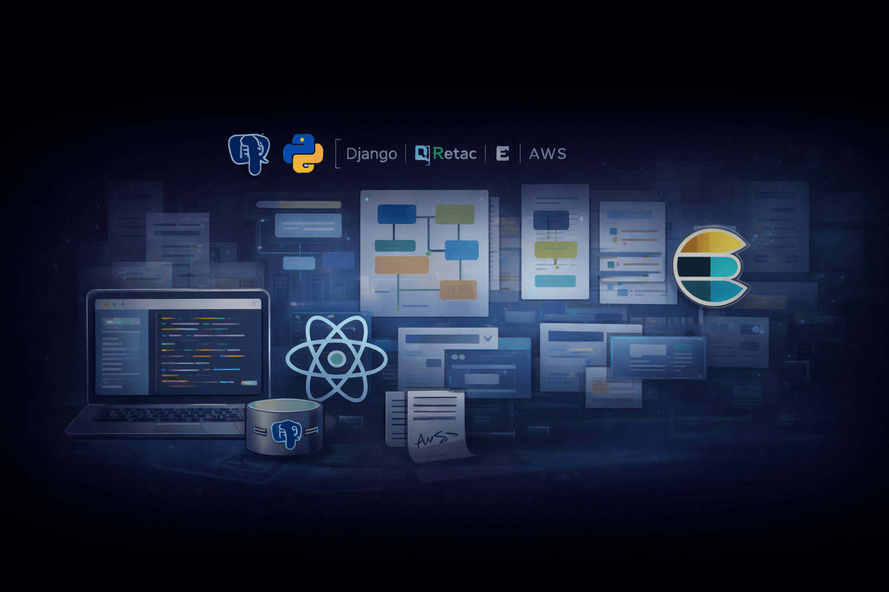

  

<h1 align="center">Joel Barrón</h1>

  <strong>Senior Backend / Full-Stack Engineer</strong> 
  Python · Django · Async Systems · Cloud Architecture

  <a href="https://joelbarron.dev">🌐 Portfolio</a> ·
  <a href="https://linkedin.com/in/joel-barron">💼 LinkedIn</a> ·
  <a href="mailto:joel.barron.hdz@gmail.com">📩 Email</a>

---

## 👨‍💻 About Me

I design and build **performance-first backend systems** for high-impact products.  
My work focuses on **scalability, reliability, and clean architecture**, with real-world experience handling **high traffic, async workloads, and complex integrations**.

- ⚙️ Query optimization, indexing strategies & profiling  
- 🔁 Resilient integrations (retries, exponential backoff, idempotency)  
- 🧵 Async processing with queues and background workers  
- 📊 Observability, migrations, and production hardening  
- 🤝 Strong collaboration with product, data, and frontend teams  

---

## 🧰 Tech Stack

### 🐍 Backend & APIs
- **Python**, **Django**, **Django REST Framework**
- FastAPI, Node.js (**AdonisJS**, Express)
- Celery, Django Channels, WebSockets
- Redis, RabbitMQ, SQS

### ⚡ Performance & Reliability
- Query optimization (PostgreSQL / SQL Server)
- Caching strategies (Redis)
- Async tasks & workers
- Retries · Timeouts · Circuit breakers
- Load testing & profiling

### 🔍 Search & Data
- PostgreSQL · SQL Server · MongoDB
- Elasticsearch / OpenSearch
- RDS

### 🎨 Frontend & Mobile
- React · React Hooks
- React Native (**Expo**)
- Astro
- Tailwind CSS

### ☁️ Cloud & Infrastructure
- **AWS** (S3, SES, SNS, RDS, Amplify)
- Azure (experience)
- Docker · Linux
- On-prem & self-hosted: **Coolify**, **Dockploy**, **Proxmox**
- GitHub Actions · CI/CD

### 🧪 Quality & Workflow
- Git · GitFlow
- SonarQube
- Linters & code quality tools
- Jira

---

## 🚀 Selected Projects

### 💰 **FinZenio** — Personal Finance + AI
> Smart personal finance platform with AI-powered statement ingestion.

- AI + OCR extraction of bank statements  
- Automatic classification that **learns from user rules**
- Budgets, analytics, subscriptions & facial identification  
- **Stack:** Django, PostgreSQL, Redis, React Native, AWS  

🌐 https://finzenio.app

---

### 🚗 **Rente** — Parking Marketplace
> Mobile-first platform for renting parking spots by date & availability.

- React Native (Expo) app + React web portal (admins & merchants)
- Date-range pre-reservations, Stripe payments
- Async notifications & webhook handling  
- **Stack:** Django, DRF, Celery, PostgreSQL, Redis, Stripe, AWS  

🌐 https://rente.mx

---

### 🧠 **Mentalysis** — Clinical Pre-Screening (DSM-5)
> Web platform used by mental health professionals.

- Adaptive questionnaires based on DSM-5
- Full-text search across symptoms, clinical histories & notes
- Clinical rules engine + Elasticsearch  
- **Stack:** Django, PostgreSQL, Elasticsearch, React  

🌐 https://mentalysis.mx

---

### 📚 **Dudi Comics** — Reading Platform for Schools
> Educational platform with gamification and engagement analytics.

- Kids mobile app with virtual pet driven by reading
- School web portal with metrics & reports
- Private distribution to schools (App Store / Play Store)
- **Stack:** Python, Django, React, React Native (Expo), Redis, S3  

---

## 📬 Contact

- 🌐 Portfolio: https://joelbarron.dev  
- 💼 LinkedIn: https://linkedin.com/in/joel-barron  
- 📩 Email: joel.barron.hdz@gmail.com  

---

  <i>Building reliable systems that scale — not just code that works.</i>

